# StockWatch 24/7 visual demo

This walkthrough shows the main StockWatch 24/7 screens without requiring visitors to install and run the application first. Click any screenshot to open it at full size.

> The screenshots contain local demonstration data. Market prices, dates, signals, scores, and congressional disclosures shown here should not be treated as current market information or financial advice.

## Public landing and authentication

### Landing page

The public landing page introduces the automated market-monitoring workflow, including candlestick signals, Elliott-wave structures, setup scores, and email delivery.

### Sign in

[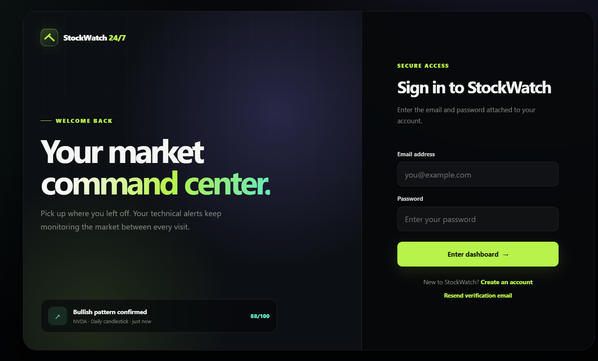](img/login.png)

The sign-in screen provides secure account access while keeping the product's market-monitoring context visible.

## Dashboard

### Technical-analysis overview

[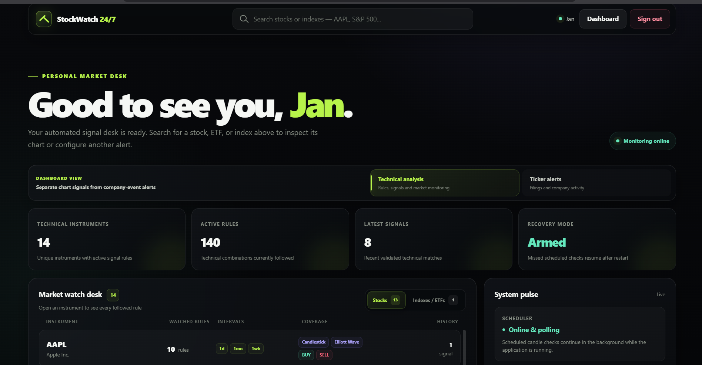](img/dashboard1.png)

Technical analysis is the default dashboard view. It summarizes followed instruments, active rules, recent signals, recovery status, the market watch desk, and the scheduler's current state.

### Latest detected signals

[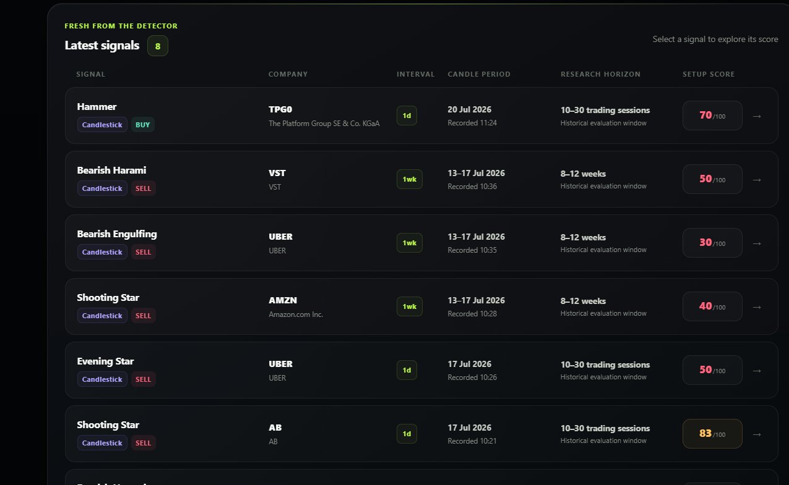](img/dashboard2.png)

The latest-signals board presents each detected pattern with its company, interval, candle period, research horizon, setup score, and additive lifecycle state. A detection remains immediate while later completed candles can resolve it as confirmed, invalidated, or expired. Selecting a row opens the full score report.

### Ticker-alert overview

[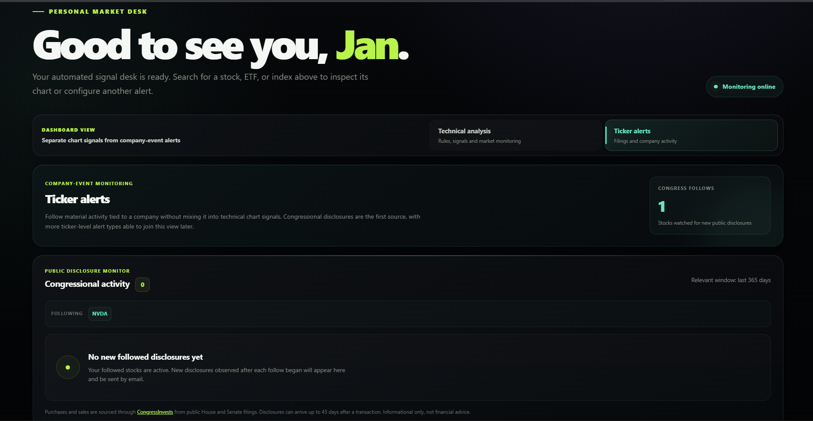](img/company_alerts.png)

The Ticker alerts view separates company-event monitoring from chart-based analysis. It shows followed stocks and newly observed congressional disclosures, with room for additional ticker-level alert sources later.

## Market workspace

### Quote, intervals, and alert rules

[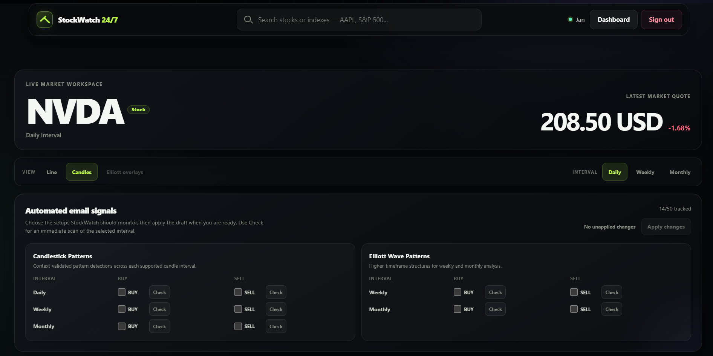](img/nvda1.png)

An individual stock workspace combines the latest quote with line/candlestick controls, daily-to-monthly intervals, and draftable email-alert rules for candlestick and Elliott-wave patterns.

### Candlestick and volume charts

[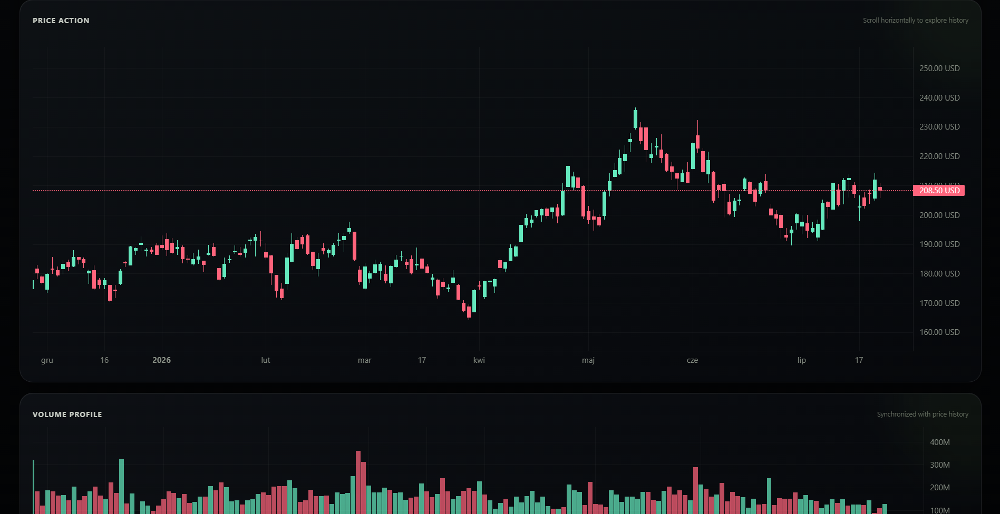](img/nvda2.png)

The price-action chart supports horizontal historical exploration and is paired with a synchronized volume profile. Older candles continue loading as the user navigates left.

### Line-chart view

[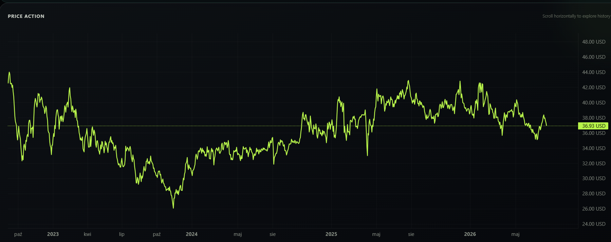](img/ab3.png)

The same workspace can switch to a clean line-chart view for quickly inspecting longer price trends without candlestick detail.

### Elliott-wave overlays

[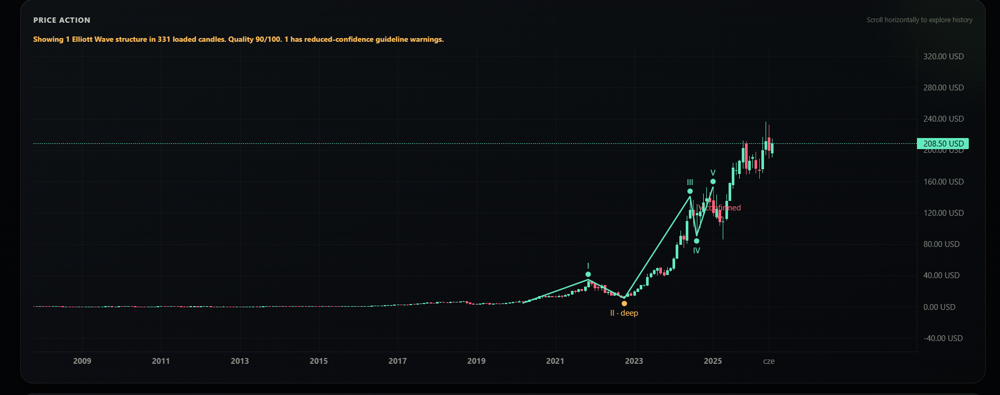](img/nvda5.png)

Weekly and monthly Elliott-wave analysis can be drawn directly over historical candles. Structure labels, confirmation points, quality scores, and reduced-confidence warnings remain visible with the chart.

## Congressional activity

### Follow controls and disclosure policy

[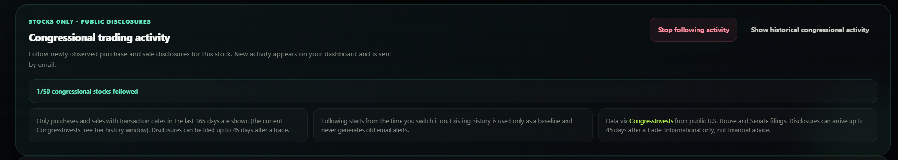](img/nvda3.png)

For stocks, users can follow newly observed congressional purchases and sales or open the historical archive. The panel also explains the relevant history window, no-retroactive-alert baseline, filing delay, and data source.

### Cached congressional history

[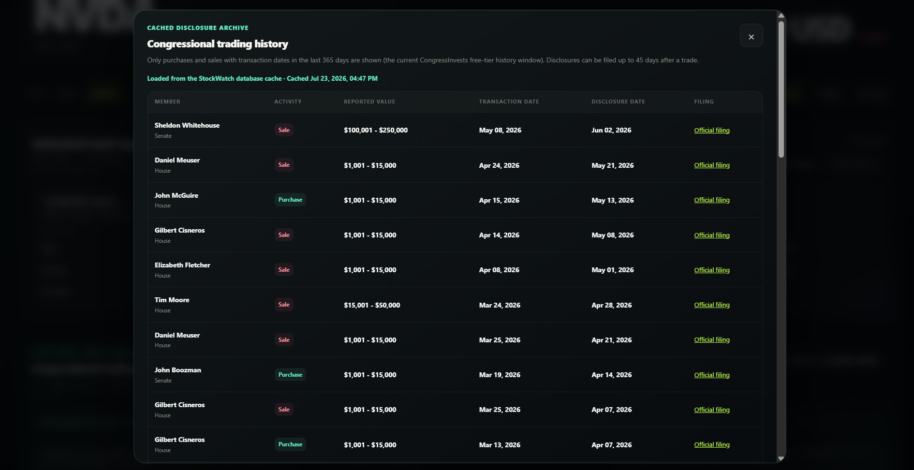](img/nvda4.png)

Historical disclosures are presented with the member, chamber, activity type, reported value range, transaction date, disclosure date, and official filing link. The cache status shows when the stored result was last refreshed.

## Monitoring history and signal intelligence

### Company monitoring board

[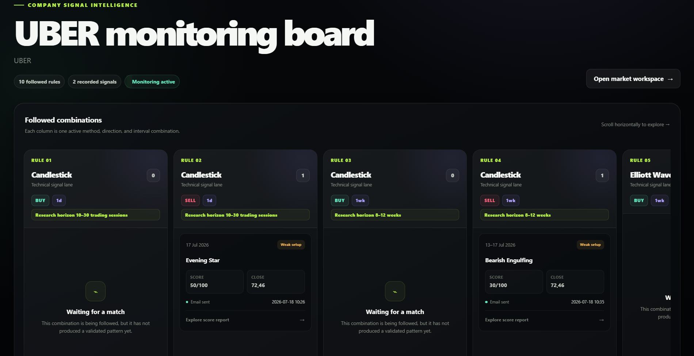](img/uber1.png)

The company board groups every followed method, direction, and interval combination into its own lane. Each lane shows either its recorded signals, delivery status, and candlestick lifecycle outcome or a waiting state when no validated match has occurred.

### Setup-score report

[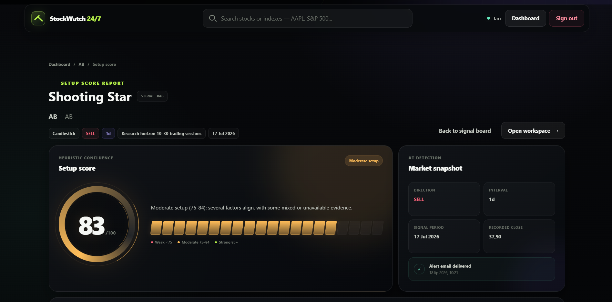](img/ab1.png)

A detected signal opens into a dedicated report containing its heuristic setup score, confidence band, direction, interval, signal period, recorded close, email-delivery status, and—when applicable—the frozen confirmation range and follow-up outcome.

### Scoring evidence

[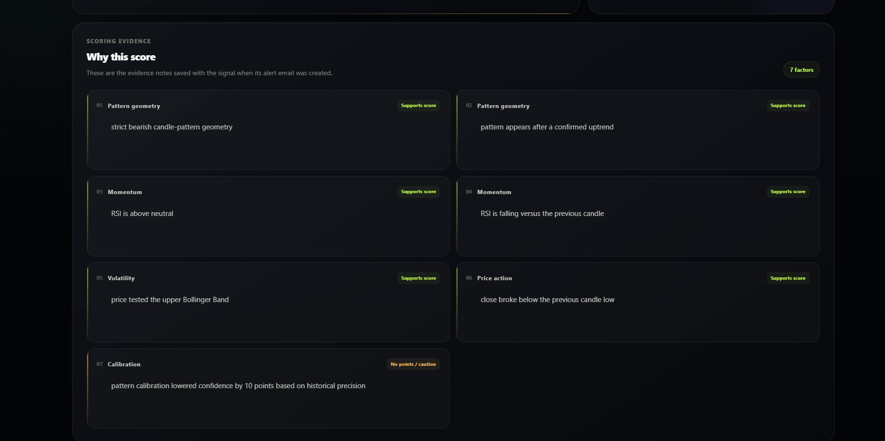](img/ab2.png)

The evidence section explains why the score received its value. Supporting and cautionary factors are preserved with the signal across pattern geometry, momentum, volatility, price action, and historical calibration.

## Continue exploring

Return to the [main README](README.md) for features, architecture, local setup, configuration, and testing instructions.
