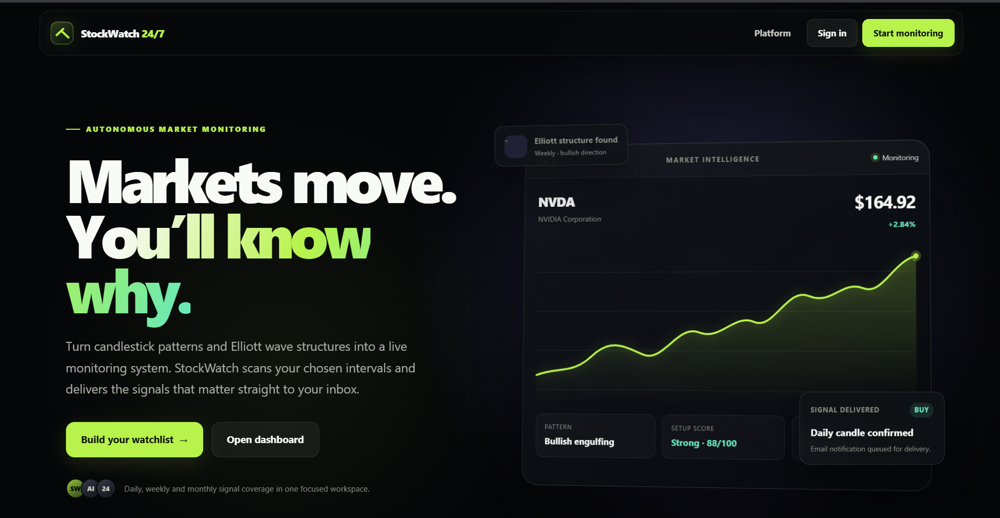

# StockWatch 24/7

## See StockWatch in action

[](DEMO.md)

### [Open the complete 14-screen visual demo &rarr;](DEMO.md)

Explore the dashboard, market workspace, charts, congressional monitoring, company alert boards, and signal-score reports before installing the application.

## About StockWatch

StockWatch 24/7 is a Spring Boot web application for exploring market data, detecting technical signals, and delivering per-user email alerts. It supports candlestick-pattern alerts on daily, weekly, and monthly candles and Elliott-wave alerts on weekly and monthly candles.

The alert scheduler is backed by PostgreSQL. If the application is offline when a daily, weekly, or monthly check should run, it reconstructs the missed schedule after restart, processes the backlog oldest-first, and evaluates the candles that were available at each original scheduled time.

> StockWatch 24/7 is provided for educational and informational purposes. It is not financial advice.

## Features

- User signup, email verification, login, and session security
- Symbol search, historical candlestick charts, and live-price lookup
- Persistent light and dark display themes available from every page
- Twelve Data market data with Yahoo Finance fallback
- Interactive classic anchored volume profiles with POC, 70% value area, cached historical candles, active-day 15-minute resolution, and two per-user live refreshes per active ticker candle
- Geometry- and trend-validated candlestick detection with a stock-only heuristic setup score and frozen higher-interval pattern calibration; scoring evidence ranks valid patterns but never creates or suppresses alerts
- Additive candlestick lifecycle emails: every detection remains immediate, then the first close-based `CONFIRMED`, `INVALIDATED`, or `EXPIRED` outcome is sent within a configurable completed-candle window
- Weekly and monthly Elliott-wave analysis
- Per-user BUY, SELL, and HOLD alert rules
- Stock-only congressional purchase/sale follows, cached history, dashboard activity, and email notifications
- SMTP email delivery to every user with a matching active alert
- Durable PostgreSQL alert jobs, retries, leases, and missed-run recovery
- Distributed rate limits, provider cooldowns, and shared quote caching
- Flyway database migrations and a restricted production database-role model
- Production HTTPS/proxy validation, security headers, and bounded request sizes
- GitHub Actions tests, CodeQL, dependency auditing, and secret scanning

## Technology

- Java 25
- Spring Boot 4.1
- Spring Security, Spring Data JPA, Thymeleaf, and Spring Mail
- PostgreSQL 16 and Flyway
- TA4J
- Maven Wrapper
- Docker Compose for the local database

## Requirements

- JDK 25
- Docker Desktop or another Docker Compose installation
- An SMTP account if email delivery is enabled
- A Twelve Data API key for Twelve Data-backed search and market data; Yahoo Finance fallback remains available where supported
- CongressInvests access for congressional activity (the current free REST tier does not require an API key)

## Local setup

1. Clone the repository and enter it:

   ```powershell
   git clone <repository-url>
   Set-Location StockWatch24-7
   ```

2. Create your ignored local environment file:

   ```powershell
   Copy-Item .env.example .env
   ```

3. Edit `.env` and replace every placeholder credential. For the local Compose database, use the same local role for runtime and migrations:

   ```text
   DB_USERNAME=uptodate
   DB_PASSWORD=<strong-local-password>
   DB_MIGRATION_USERNAME=uptodate
   DB_MIGRATION_PASSWORD=<same-strong-local-password>
   ```

   Production deployments should use separate runtime and migration roles as described in the deployment guide.

4. Start PostgreSQL:

   ```powershell
   docker compose up -d postgres
   ```

5. Start the application:

   ```powershell
   .\mvnw.cmd spring-boot:run
   ```

6. Open [http://localhost:8080](http://localhost:8080).

Flyway applies pending migrations automatically in the default development profile.

## Email alerts

Email delivery is disabled by default. To enable it, configure these values in `.env`:

```text
ALERTS_EMAIL_ENABLED=true
ALERTS_EMAIL_FROM=no-reply@example.com
SMTP_HOST=smtp.example.com
SMTP_PORT=587
SMTP_USERNAME=<smtp-user>
SMTP_PASSWORD=<smtp-password>
SMTP_AUTH=true
SMTP_STARTTLS=true
SMTP_STARTTLS_REQUIRED=true
MFA_ENCRYPTION_KEY=<at-least-32-random-characters>
```

`MFA_ENCRYPTION_KEY` protects authenticator-app secrets at rest. Keep it stable across restarts and instances; changing or losing it makes existing authenticator enrollments unreadable. Production refuses to start with a missing or placeholder key.

Each alert rule belongs to a user. A scheduled symbol/interval check is shared, but every matching active rule is evaluated independently and mail is sent to each rule owner's address. Users' laptops do not need to remain online.

Directional candlestick detections also start an additive lifecycle. The initial
`DETECTED` email is never delayed or suppressed. Over the next three completed
candles by default, the first close beyond the frozen pattern range produces
either a `CONFIRMED` or `INVALIDATED` email; a setup that crosses neither
boundary becomes `EXPIRED`. Pending lifecycle events remain durably scheduled
through restarts and missed-run recovery. Elliott-wave alerts are unchanged.

## Congressional activity

Congressional purchase and sale disclosures are read through the free
[CongressInvests](https://congressinvests.com/) REST API. The feature is
stock-only and uses one canonical PostgreSQL record for both historical views
and alerts:

1. A history request checks shared database coverage first. A provider request
   is made only when the cache is missing or stale, including when the valid
   result is empty. After any provider refresh attempt, successful or failed,
   that ticker remains on cooldown until midnight UTC. Cached requests remain
   available and do not consume refresh quota.
2. Switching on a follow establishes a historical baseline. Backfilled records
   never generate old emails.
3. A shared poll runs at most once every six hours across the deployment.
   Newly observed disclosures are deduplicated, shown on the dashboard, and
   queued for durable email delivery.
4. The application enforces a default provider budget of 90 requests per UTC
   day across all instances, below the current free-tier limit of 100.
5. Each user can trigger at most two uncached ticker refreshes per minute.
   Congressional API routes also retain the general 30-request-per-minute
   guard.

The UI explicitly limits history to the provider's current 365-day free-tier
window and notes that STOCK Act disclosures may arrive up to 45 days after a
transaction. This data is informational only and is not financial advice.

CongressInvests currently lists white-label/embedding rights under its
Enterprise offering and the underlying official sources have their own usage
terms. Before monetizing, advertising, redistributing, or embedding this
feature commercially, obtain the appropriate written commercial rights and
upgrade the provider agreement. The provider is isolated behind
`CongressionalTradeProvider` so it can be replaced without changing the
subscription, cache, dashboard, or delivery model.

## Durable schedule recovery

Daily, weekly, and monthly schedule occurrences are checkpointed in PostgreSQL. On startup and during periodic recovery checks, the application:

1. Finds cron occurrences missed while the server was offline.
2. Creates each logical run only once, including when multiple app instances start together.
3. Queues one check per active symbol/interval and per symbol/interval with a pending candlestick lifecycle.
4. Processes a symbol's backlog in its original order.
5. Uses the original `scheduled_for` time as the candle-data cutoff.
6. Reclaims work left in progress after an expired worker lease.

The default recovery batch is 100 schedule occurrences per pass, preventing an extended outage from producing an unbounded startup burst.

## Configuration

The complete development template is in [`.env.example`](.env.example). Important settings include:

| Setting | Purpose |
| --- | --- |
| `DB_URL`, `DB_USERNAME`, `DB_PASSWORD` | Runtime PostgreSQL connection |
| `DB_MIGRATION_USERNAME`, `DB_MIGRATION_PASSWORD` | Flyway migration role |
| `TWELVE_DATA_API_KEY` | Twelve Data access |
| `ANCHORED_VOLUME_PROFILE_PRICE_BINS` | Price rows used by the estimated anchored profile (default `48`) |
| `ANCHORED_VOLUME_PROFILE_VALUE_AREA_PERCENT` | Volume percentage enclosed by VAH/VAL (default `70`) |
| `ANCHORED_VOLUME_PROFILE_MAXIMUM_LIVE_REFRESHES` | Per-user provider refreshes for a ticker and active candle (fixed maximum `2`) |
| `ALERTS_EMAIL_ENABLED` | Enables signal and verification email delivery |
| `SMTP_*` | SMTP transport and STARTTLS settings |
| `MFA_ENCRYPTION_KEY` | Stable production secret used to encrypt authenticator-app seeds |
| `ALERT_SCHEDULE_ENABLED` | Enables scheduled alert recovery and workers |
| `ALERT_JOB_LEASE_SECONDS` | Worker lease before abandoned work can be reclaimed |
| `ALERT_CATCH_UP_BATCH_SIZE` | Maximum missed schedule occurrences recovered per pass |
| `ALERT_CANDLESTICK_LIFECYCLE_WINDOW_CANDLES` | Completed candles observed before an unresolved candlestick setup expires (default `3`, range `1-20`) |
| `CONGRESSIONAL_ACTIVITY_ENABLED` | Enables stock-only congressional history and follows |
| `CONGRESSIONAL_ACTIVITY_MAX_UNCACHED_REFRESHES_PER_USER_PER_MINUTE` | Per-user uncached ticker refresh ceiling (default `2`); cache hits do not count |
| `CONGRESS_INVESTS_DAILY_REQUEST_BUDGET` | Shared UTC daily call ceiling (default `90`) |
| `CONGRESS_INVESTS_API_KEY` | Optional paid-plan key; leave blank on the free tier |
| `CONGRESSIONAL_ACTIVITY_POLL_INTERVAL_HOURS` | Minimum interval between shared provider polls (default `6`) |
| `SPRING_PROFILES_ACTIVE=prod` | Enables production security requirements |

Never commit `.env`, database passwords, SMTP credentials, or API keys. Store production secrets in the hosting platform's secret manager.

## Testing

Run the complete test suite:

```powershell
.\mvnw.cmd test
```

Run the dependency security gate:

```powershell
.\mvnw.cmd -Psecurity-scan -DskipTests verify
```

Some historical backtests are intentionally opt-in through their documented JVM system properties and are skipped during the regular test suite.

## Production deployment

Production requires the `prod` Spring profile, HTTPS behind a trusted reverse proxy, secure SMTP, and separate database roles. Run the one-shot Flyway migration process before starting a runtime instance with migrations disabled.

See [Secure deployment checklist](docs/security-deployment.md) for the required environment, migration command, Nginx example, network boundaries, and release checks.

## Contributions

StockWatch 24/7 is proprietary software. Unsolicited code contributions are not accepted unless the contributor first signs a written agreement that gives the project owner the rights required to incorporate and commercially license the contribution.

## License

Copyright © 2026 Jan Gradkowski. All rights reserved.

StockWatch 24/7 is proprietary software. No permission is granted to use, copy, modify, distribute, sublicense, sell, host, or create derivative works without a separate written, paid commercial license from the copyright owner. See the [StockWatch 24/7 Proprietary Commercial License](LICENSE).

Revisions previously distributed under the Apache License, Version 2.0 remain under that license; the proprietary license applies prospectively from the repository revision in which it was introduced. Third-party components remain governed by their own licenses.
